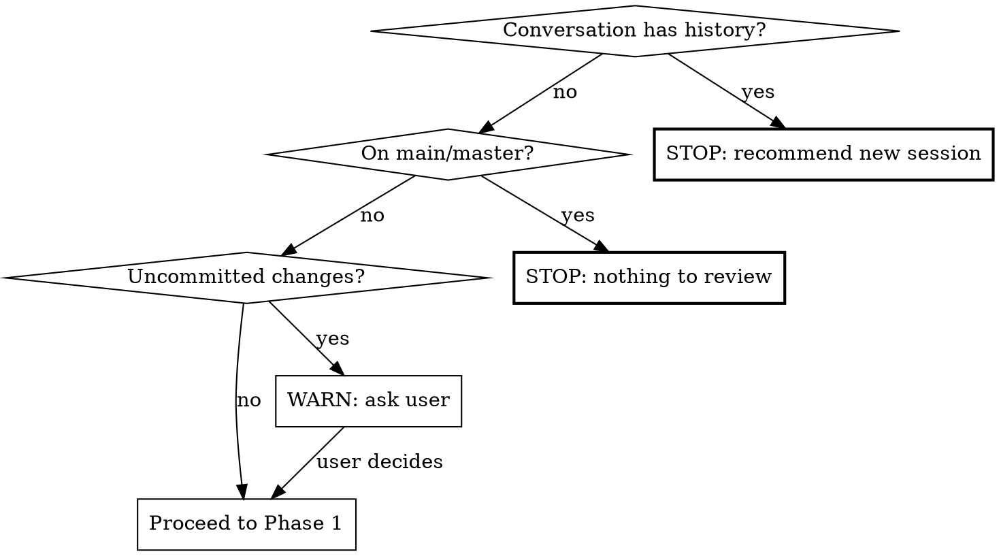

# Agentic Code Review

Multi-agent bug-hunting review of the current branch against main. Dispatches specialist agents in parallel, verifies findings to filter false positives, ranks by severity, and produces a persistent report.

**This is a technique skill.** Follow the phases in order. Do not skip verification.

## Pre-flight Checks



1. **Context window:** If conversation has substantive history beyond invoking this skill, tell the user: "This review consumes significant context. Start a fresh session with `/paad:agentic-review` to avoid context rot." Stop and wait.
2. **Branch:** Must not be on main/master. If so, stop.
3. **Clean state:** If uncommitted changes exist, ask: review committed state only, or wait to commit?

## Phase 1: Reconnaissance

Run these commands and collect results:

1. `git diff --stat main...HEAD` — files and line counts
2. `git diff main...HEAD` — full diff content
3. Classify diff size:
   - **Small:** <50 lines changed
   - **Medium:** 50-500 lines changed
   - **Large:** 500+ lines changed
4. Scan for plan/design docs: `docs/plans/`, `aidlc-docs/`, or similar
5. Scan for steering files: `CLAUDE.md`, `AGENTS.md`, etc.
6. For each changed file, grep for callers/callees one level deep (function/method names from the diff)
7. When the diff includes infrastructure files (schema migrations, build configs, CI pipelines, environment templates), check whether test-side counterparts exist (e.g., test resource directories with their own migrations, test-specific configs). Add any unmatched test infrastructure to the manifest for the Contract & Integration specialist.
8. For **small** diffs: expand scope to full module/package for each changed file
9. Build manifest: files to review (changed + adjacent), grouped for specialists

**Steering file caveat:** Include in every agent prompt: "Steering files (CLAUDE.md, etc.) describe conventions but may be stale. If you find a contradiction between steering files and actual code, flag it as a finding."

## Phase 2: Specialist Review (Parallel)

Dispatch these agents simultaneously using the Agent tool. Each receives: the diff, manifest of files to review, steering file contents, and their specialist focus.

| Agent | Lens | Scope |
|-------|------|-------|
| **Logic & Correctness** | Wrong conditions, off-by-one, null paths, state transitions, algorithm errors, new code paths that skip processing/validation/cleanup present in sibling paths | Changed code + surrounding functions |
| **Error Handling & Edge Cases** | Missing catches, swallowed exceptions, boundary validation, silent failures | Changed code + error paths in callers |
| **Contract & Integration** | Signature vs callers, type mismatches, broken API contracts, data shape drift, logic duplication | Changed code + callers/callees one level |
| **Concurrency & State** | Races, shared mutable state, cache invalidation, ordering assumptions | Changed code + shared state access |
| **Security** | Injection, auth gaps, data exposure, OWASP top 10 | Changed code + input/output boundaries |

**Conditionally (if plan/design docs found):**

| Agent | Lens | Input |
|-------|------|-------|
| **Plan Alignment** | Changes vs plan, deviations, partial completion | Diff + plan docs |

Plan Alignment must use neutral tone for unimplemented items — partial implementation is expected.

**Agent prompt template:**

Each specialist agent prompt must include:
- The full diff
- Contents of files in their review scope
- Steering file contents with the staleness caveat
- Instruction: "You are a specialist reviewer focused on [LENS]. Find bugs, not style issues. For each finding report: file:line, what's wrong, why it matters, suggested fix, and your confidence (0-100). Only report findings with confidence >= 60."

**Error Handling & Edge Cases additional instruction:** "When code parses external output (API responses, LLM completions, user input) using exact string matching (equals, switch, regex), check whether realistic output variations — trailing punctuation, extra whitespace, mixed casing, surrounding formatting — would cause silent misclassification or wrong defaults."

**Contract & Integration additional instruction:** "Also flag: new code that reimplements logic already available in the codebase (check for existing utilities, helpers, or services that do the same thing). Flag duplicated code blocks within the diff that could be parameterized into a single function. Frame these as integration issues — duplicated logic diverges over time and causes bugs."

**Scaling for large diffs (500+ lines):** Partition files across 2 instances of each specialist (e.g., Logic-A gets half the files, Logic-B gets the other half).

## Phase 3: Verification

After all specialists complete, dispatch a single **Verifier** agent with all findings. The verifier:

1. For each finding, reads the actual current code at the referenced file:line
2. Confirms the bug exists and isn't handled elsewhere
3. Drops false positives and findings below 60% confidence
4. Assigns severity: **Critical** / **Important** / **Suggestion**
5. Raises confidence threshold: only keeps findings >= 60% after verification
6. Deduplicates findings flagged by multiple specialists (note which specialists agreed)

**Verifier prompt must include:** "You are verifying bug reports. For each finding, read the actual code and confirm the bug exists. Be skeptical — reject anything you cannot confirm by reading the code. A finding reported by multiple specialists is more likely real."

## Phase 4: Report

Write verified findings to `paad/code-reviews/<branch>-<YYYY-MM-DD-HH-MM-SS>-<short-sha>.md`.

Create the `paad/code-reviews/` directory if it doesn't exist.

**Report template:**

```markdown
# Agentic Code Review: <branch-name>

**Date:** YYYY-MM-DD HH:MM:SS
**Branch:** <branch> -> <base>
**Commit:** <full-sha>
**Files changed:** N | **Lines changed:** +X / -Y
**Diff size category:** Small / Medium / Large

## Executive Summary

2-3 sentences: overall assessment, highest-severity finding if any, general confidence level.

## Critical Issues

### [C1] <title>
- **File:** `path/to/file:line`
- **Bug:** What's wrong
- **Impact:** Why it matters
- **Suggested fix:** Concrete recommendation
- **Confidence:** High/Medium
- **Found by:** <specialist name(s)>

(Repeat for each critical issue, or "None found.")

## Important Issues

(Same structure as Critical, or "None found.")

## Suggestions

One-line entries only. Omit section if none.

## Plan Alignment

(Only if plan/design docs were found)
- **Implemented:** Plan items reflected in this diff
- **Not yet implemented:** Remaining items (neutral — partial is expected)
- **Deviations:** Anything contradicting the plan

## Review Metadata

- **Agents dispatched:** <list with focus areas>
- **Scope:** <files reviewed — changed + adjacent>
- **Raw findings:** N (before verification)
- **Verified findings:** M (after verification)
- **Filtered out:** N - M
- **Steering files consulted:** <list or "none found">
- **Plan/design docs consulted:** <list or "none found">
```

## Common Mistakes

These patterns produce low-quality reviews. Avoid them:

| Mistake | What to do instead |
|---------|-------------------|
| Single-agent review (no parallel dispatch) | Always dispatch 5+ specialist agents in parallel via Agent tool |
| Skipping verification | Always run verifier — unverified findings have high false positive rates |
| Reporting style/quality nits | Specialists hunt **bugs**, not code style. "Missing test" is a suggestion at best, not a bug. |
| Not tracing callers/callees | The best bugs hide at integration boundaries. Always trace one level deep. |
| Not reading adjacent test files | Tests that pass accidentally (via catch-all mocks, wrong stubs) are real bugs. Check sibling tests. |
| Skipping steering files | Read CLAUDE.md etc. for context, but flag contradictions rather than trusting blindly |
| Reporting without file:line references | Every finding must reference exact code location — unanchored findings are not actionable |
| Ignoring logic duplication | New code reimplementing existing helpers is a bug waiting to happen — Contract & Integration agent must check for this |
| Ignoring test infrastructure | When production infrastructure changes (schema migrations, build configs, environment templates), check if parallel test infrastructure exists and needs matching updates |

## Post-Review

After writing the report:
1. Tell the user the report location and finding counts by severity
2. Tell them: "To address these findings, review each issue in the report and fix them with per-fix commits. If you have the [superpowers](https://github.com/obra/superpowers/) plugin installed, you can use the `receiving-code-review` skill and point it at this report for a guided workflow."
3. Do **not** auto-fix anything. The report is the deliverable.
