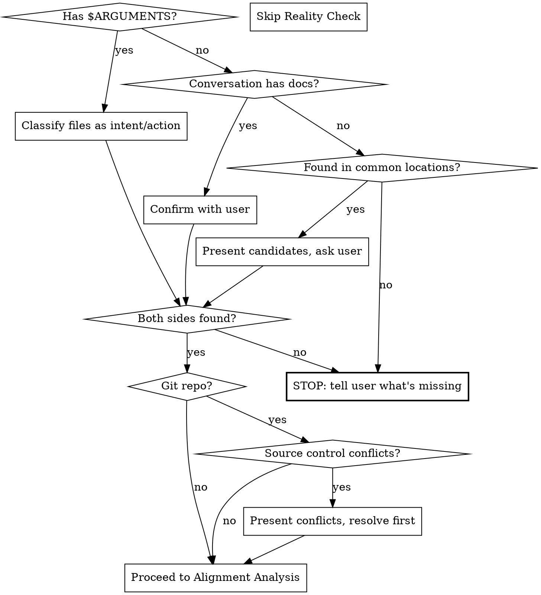

# Alignment Check

Verifies that intent documents (requirements, specs, PRDs) and action documents (plans, tasks, implementation steps) are aligned. Finds gaps in both directions — unaddressed requirements and out-of-scope tasks — then rewrites all tasks in TDD red/green/refactor format.

**This skill does NOT recommend a fresh session.** The conversation history may contain the documents.



## Arguments

`/paad:alignment` accepts optional `$ARGUMENTS`:

- `/paad:alignment` — auto-detect documents from conversation history or common file locations
- `/paad:alignment requirements.md plan.md` — check alignment between specific files
- `/paad:alignment docs/specs/ docs/plans/` — check alignment across directories

When file paths are provided, the skill classifies each as intent or action and proceeds. When multiple files are provided, the skill determines their relationships automatically.

## Input Resolution

Resolve the documents to check in this order:

1. **`$ARGUMENTS` contains file paths** → use those files, classify each as intent (what we want) or action (what we'll do) based on content
2. **Conversation history contains requirements/plans** (from brainstorming, planning, or spec writing) → confirm with user: "I see the design and plan we discussed — should I check their alignment?"
3. **Scan common locations** (in order):
   - `.kiro/` — Kiro requirements, design, and task files
   - `specs/` — spec-kit feature specs and plans (`spec.md`, `plan.md` per feature folder); also check `SPECIFY_SPECS_DIR` env var
   - `.specify/memory/constitution.md` — spec-kit project constitution
   - `docs/plans/`, `docs/specs/` — common conventions
   - `requirements.md`, `design.md`, `tasks.md`, `spec.md`, `plan.md`, `PRD.md` — repo root
   - Recently modified markdown files as fallback
   - Present candidates grouped as intent vs action, ask user to confirm
4. **If nothing found or only one side found** → tell the user what's missing: "I found requirements but no implementation plan. Point me to the plan, or describe it and I'll work from that."

### Document classification

- **Intent documents** (source of truth): requirements, specs, PRDs, user stories, feature descriptions — these define *what* we want
- **Action documents** (plan of work): implementation plans, task lists, step-by-step plans, tickets — these define *what we'll do*
- **Intermediate documents** (optional bridge): architecture designs, technical designs — checked for alignment in both directions if present

## Phase 1: Reality Check (Source Control)

**Skip this phase if the project is not a git repository.**

Before analyzing document alignment, check whether recent codebase changes conflict with what the documents assume:

1. Run `git log --oneline -50 --since="2 weeks ago"` (whichever limit is reached first)
2. Read commit messages and, for relevant-looking commits, check the actual diffs
3. Compare against what the documents assume — do they reference code, APIs, schemas, infrastructure, or patterns that have recently been changed, removed, or replaced?
4. **If conflicts found:** present them upfront before any other analysis. For each conflict:
   - What the documents assume
   - What actually changed (commit SHA, date, summary)
   - Why this matters for alignment
   - Ask: "How do you want to handle this?" with options
5. **If no conflicts found:** say "No conflicts with recent changes" and move on

## Phase 2: Alignment Analysis

Perform three checks against the classified documents:

### 1. Requirements coverage

For every item in the intent documents, check whether at least one action item addresses it.

- Flag requirements with no corresponding tasks
- Flag requirements only partially covered (e.g., happy path has a task but error handling doesn't)
- Note which requirements are well-covered

### 2. Scope compliance

For every item in the action documents, check whether it traces back to a stated requirement.

- Flag tasks that don't map to any requirement (scope creep or gold-plating)
- Flag tasks that seem to address implied but unstated requirements (may be legitimate — ask)
- Note tasks that are clearly in scope

### 3. Design alignment (only if intermediate design docs exist)

Check both directions:
- Does the design address all requirements?
- Do the tasks implement the design, or do they bypass it?
- Flag design decisions that aren't reflected in tasks
- Flag tasks that contradict or ignore the design

## Phase 3: Issue Presentation

Present issues **dependency-ordered** so that fixing upstream problems first may resolve downstream ones:

1. **Missing or unclear requirements** first (root causes) — a missing requirement explains why there's no task for it and no design for it
2. **Design gaps** second (if design docs exist) — a design gap may explain why tasks are missing or wrong
3. **Missing, orphaned, or out-of-scope tasks** last (symptoms) — these often resolve when upstream issues are fixed

### For each issue

- State the specific documents and sections that are misaligned
- Explain the nature of the misalignment (missing coverage, out of scope, design gap)
- Assign severity: **Critical** / **Important** / **Minor**
- Present concrete options from best to worst, with recommendation
- Wait for the user's response before presenting the next issue

The user can say "good enough" or "stop" at any point.

### Analysis guidance

- **Read the codebase.** Don't just compare documents — check whether what they describe matches the actual code.
- **Understand intent.** A requirement that says "user authentication" and a task that says "implement login flow" are aligned even if the wording differs. Match on meaning, not keywords.
- **Respect intentional omissions.** If a requirement is explicitly marked as out of scope or future work, don't flag missing tasks for it.
- **Flag implicit requirements.** If a task requires infrastructure or capabilities not mentioned in requirements (e.g., tasks assume a message queue but requirements never mention async processing), flag the gap.

## Phase 4: Resolution

After all issues are addressed (or user says "good enough"):

### Step 1: Update documents

Ask: **"Would you like me to update the documents to reflect our alignment decisions, or write a separate alignment report?"**

**If updating documents:**
- Apply agreed changes to the original files
- Add missing requirements, remove out-of-scope tasks, fill design gaps
- Don't touch items that weren't discussed

**If writing a report:**
Write to `paad/alignment-reviews/<YYYY-MM-DD>-<topic>-alignment.md`.

Create the `paad/alignment-reviews/` directory if it doesn't exist.

**Report template:**

```markdown
# Alignment Review: <topic or project name>

**Date:** YYYY-MM-DD
**Commit:** <current HEAD sha, or "N/A">

## Documents Reviewed

- **Intent:** <file paths or "conversation history">
- **Action:** <file paths or "conversation history">
- **Design:** <file paths, or "none">

## Source Control Conflicts

<conflicts found, or "None — no conflicts with recent changes.">

## Issues Reviewed

### [1] <title>
- **Category:** <missing coverage / out of scope / design gap>
- **Severity:** <critical / important / minor>
- **Documents:** <which documents are misaligned>
- **Issue:** <what's wrong>
- **Resolution:** <what the user decided>

(Repeat for each issue discussed.)

## Unresolved Issues

(Issues not yet discussed. Omit section if all were addressed.)

## Alignment Summary

- **Requirements:** N total, M covered, K gaps
- **Tasks:** N total, M in scope, K orphaned
- **Design items:** N total, M aligned (if applicable)
- **Status:** <aligned / needs further work>
```

**If documents came from conversation history:**
Ask: "The documents aren't saved to files yet. Where should I write them?" Suggest a reasonable path based on project structure.

### Step 2: TDD task rewrite (mandatory)

Once alignment is confirmed, rewrite all action items in red/green/refactor format. This is not optional — it produces better implementations.

**Why this works:**

- **RED — Write a failing test first.** Defines expected behavior before writing code. Occasionally the test passes immediately, revealing that the feature already exists or that assumptions are wrong. More commonly, the test fails in unexpected ways that highlight unknown issues in the codebase. Both outcomes are valuable information you'd otherwise miss.

- **GREEN — Write minimal code to pass.** Forces simpler solutions. The AI looks at the problem more directly instead of over-engineering. Less speculative code means less "slop."

- **REFACTOR — Clean up what you just wrote.** This is the step AI almost never does unless explicitly told to. It catches duplicated code that should be extracted, hard-coded values that belong in config, inconsistent patterns that should be consolidated, and other small issues that compound over time.

**Format for each task:**

```markdown
### Task: <task name>

**Requirement:** <which requirement this addresses>

#### RED
- Write a test that: <what the test asserts>
- Expected failure: <how and why it should fail>
- If it passes unexpectedly: <what that would mean>

#### GREEN
- Implement: <minimal implementation to pass the test>
- Constraints: keep it simple — no anticipatory abstractions

#### REFACTOR
- Look for: <specific refactoring opportunities>
  - Duplicated logic to extract
  - Hard-coded values to move to config
  - Patterns to consolidate with existing code
  - Naming improvements
```

Rewrite the tasks in the action document in-place, or write to a new file if the user prefers.
