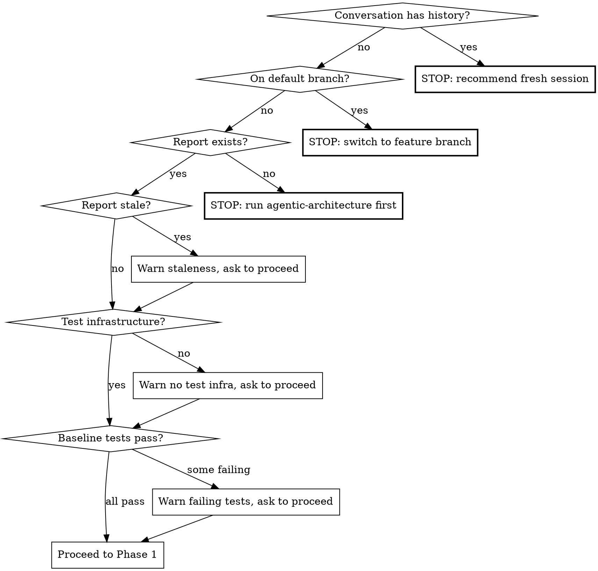

# Fix Architecture

Guided, iterative fixing of architectural flaws identified by `/paad:agentic-architecture`. Loads an existing architecture report, walks the developer through selecting and prioritizing flaws, then fixes them one at a time with a test-first workflow. Updates the report with status tracking so the skill can be re-run across multiple sessions.

**This is a technique skill.** Follow the phases in order. Do not skip validation or testing steps.

## Arguments

`/paad:fix-architecture` accepts optional `$ARGUMENTS`:

- `/paad:fix-architecture` — finds the most recent report in `paad/architecture-reviews/` by date prefix
- `/paad:fix-architecture path/to/report.md` — uses a specific report

## Pre-flight Checks



1. **Context window:** If conversation has substantive history beyond invoking this skill, tell the user: "This skill consumes significant context. Start a fresh session with `/paad:fix-architecture` to avoid context rot." Stop and wait.

2. **Branch protection:** Refuse to operate on the default branch (main/master/trunk). Detect via `git symbolic-ref refs/remotes/origin/HEAD 2>/dev/null` (local, instant), falling back to branch name matching (`main`/`master`/`trunk`), and only falling back to `git remote show origin` as a last resort if neither works. If on the default branch: "Architecture fixes must be done on a feature branch. Create one and re-run this skill." Stop and wait.

3. **Report exists:** Locate the report from `$ARGUMENTS` or find the most recent file in `paad/architecture-reviews/` by date prefix. If none found: "No architecture report found. Run `/paad:agentic-architecture` first to generate one." Stop and wait.

4. **Report staleness:** Parse the SHA from the report's `**Commit:** <full-sha>` header field. Compare against current state:
   - Count commits since report: `git rev-list --count <report-sha>..HEAD`
   - If >20 commits or report date >14 days old, warn: "This report was generated N commits / N days ago. Some findings may be outdated. I'll validate each flaw before fixing, but consider re-running `/paad:agentic-architecture` for a fresh baseline."
   - Ask explicitly: "Proceed anyway? (yes / no / re-run `/paad:agentic-architecture` first)"

5. **Test infrastructure:** Check whether the project has a test framework, runner, and conventions (e.g., a `test/` or `__tests__/` directory, a test script in `package.json`, pytest config, etc.). If no test infrastructure exists: "This project has no test infrastructure. Fixes without tests are high-risk. Want to set up a test framework first, proceed without tests, or stop?" Wait for the developer's decision.

6. **Baseline test run:** Run the existing test suite to establish a green baseline. If tests are already failing: "N tests are currently failing before any changes. This means I can't reliably attribute test failures to my fixes. Proceed anyway, or fix the failing tests first?" Record which tests are failing so step 3e can distinguish pre-existing failures from newly introduced ones.

## Phase 1: Developer Conversation

A setup conversation before any code is touched. **One question per message. Ask, wait for the answer, then ask the next.** Do not combine multiple questions into one message — it is frustrating and overwhelming.

### Step 1: Team Context

> "Are you working solo or on a team? This affects how many fixes I'll recommend per session."

- **Solo** → recommend larger batches (3-5 fixes), note that conflicts are unlikely
- **Team** → recommend 1-2 fixes per session, warn about conflict risk with other developers' work

### Step 2: Commit Preference

> "When I complete a fix, should I commit automatically, or would you prefer to review and commit yourself?"

Two modes:
- **Auto-commit** — skill commits after each successful fix (one commit per fix, including tests and report update)
- **Manual commit** — skill leaves changes staged, tells the developer what was changed

### Step 3: Flaw Triage

Present flaws from the report, excluding any already marked as Fixed or Won't Fix. Group by impact level (High / Medium / Low). Before presenting, do a lightweight dependency scan:

- Cross-reference file paths across flaws — flaws in the same file(s) are likely related
- Cross-reference categories — e.g., god object (F-02) + low cohesion (F-11) on the same class
- Present related flaws as groups: "F-02 and F-11 both affect `UserService.ts` — fixing F-02 first will likely resolve F-11"

Then ask:

> "What would you like to focus on?
> 1. High-impact flaws first
> 2. Quick wins (low-complexity fixes)
> 3. Specific flaws (pick by F-ID)
> 4. Something else"

If the developer picks "quick wins," do a lightweight scan of the affected code before presenting candidates — check file size, number of references, whether the fix is localized or cross-cutting. Present the ones that look genuinely simple with a caveat: "Based on a quick scan, these look straightforward — but I'll verify each one before fixing."

Based on the developer's answer and team context, recommend a batch size and let them select specific flaws.

If no unfixed flaws remain (all are marked Fixed or Won't Fix), congratulate the developer and suggest re-running `/paad:agentic-architecture` for a fresh analysis to find any new issues. Stop.

### Step 4: Plan Confirmation

Summarize the full plan:
- Selected flaws in fix order (ordered by: dependencies first — flaws that unblock others; then by impact — High before Medium before Low; then by complexity — simpler first within the same impact level. The developer can override this order.)
- Known dependencies between them
- Testing note: "Test coverage will be assessed per-flaw before each fix — I'll verify what's actually covered, not assume."
- Batch size
- Commit mode

Get explicit go-ahead before touching any code.

## Phase 2: Safety-Net Tests (if batch > 1)

If the batch contains more than one flaw, write all safety-net tests **before any fixes are applied.** Refactoring one flaw can break code that another flaw's tests would have caught — but only if those tests exist yet. The safe approach:

1. For each flaw in the batch, run steps 2a and 2b (validate and assess test coverage)
2. Write and commit all safety-net tests upfront
3. Then proceed to the fix loop (starting at 2c for each flaw)

If the batch contains only one flaw, steps 2a and 2b run inline as part of the fix loop below.

## Phase 3: The Fix Loop

For each flaw in the confirmed batch, execute this sequence:

### 3a. Validate the Flaw

Read targeted sections around the referenced file:line (not entire files — conserve context window). Check `git log` on affected files since the report date. Determine outcome:

| Outcome | Action |
|---------|--------|
| Still exists as described | Proceed to 3b |
| Partially addressed | Explain what changed, ask developer if it still needs work |
| No longer exists | Mark "Fixed (pre-existing)" in report with date and commit SHA, move to next |
| False positive / wrong | Explain why, ask developer. If agreed, mark "Won't fix — false positive" |

If uncertain about any flaw, ask the developer specifically rather than guessing.

### 3b. Assess Test Coverage

Check whether the affected code has existing tests. Three outcomes:

**Good coverage exists** → "good" means no significant gaps were found in the paths that will be affected by the fix. If gaps are identified during assessment — even if overall coverage looks strong — fill them with safety-net tests before proceeding. Do not dismiss gaps as "edge cases" and proceed anyway.

**Testable but untested** → write tests for existing behavior first, then red/green/refactor the fix. Flag this as higher risk: "This code has no tests. I'll write tests for the current behavior first so we have a safety net." In auto-commit mode, commit the safety-net tests separately before applying the fix, so they can be preserved independently if the fix is reverted.

**Not unit-testable without refactoring** → analyze the code and present feasible, specific testing approaches with tradeoffs. The skill must assess *how* to write tests concretely, not offer abstract categories:

1. Refactor for testability first, then fix (safest, more work)
2. Write end-to-end/integration tests covering the affected paths — explain specifically how (e.g., "test via the `/api/orders` endpoint which exercises this validation path")
3. Fix without tests (risky)
4. Skip this flaw for now

If only one testing approach is feasible, present it with explanation of why alternatives aren't viable. Developer chooses.

### 3c. Propose Fix Options

If multiple fix approaches exist, present as a numbered list:
- Recommended option first, with reasoning
- Each option includes: what changes, files affected, tradeoffs (complexity, risk, scope)

If only one reasonable approach, present it and get confirmation.

### 3d. Execute the Fix

Follow red/green/refactor:
1. **Red** — write/update tests that fail against the current code (for the desired behavior)
2. **Green** — make the minimal code change to pass tests
3. **Refactor** — clean up if warranted

### 3e. Handle Test Failures

If tests fail after the fix:

1. Analyze *which* tests failed and *why*
2. Cross-reference against the pre-flight baseline — if a test was already failing before the session, it's not caused by this fix
3. **Internal unit tests breaking because structure changed** → expected during refactoring, propose updating them
4. **External/integration tests breaking** → red flag, discuss with developer whether to fix forward or revert
5. Developer decides how to proceed

After the fix passes, do a brief sanity check: does the change introduce any obvious new architectural issues (e.g., splitting a god object but creating tight coupling between the new modules)? If so, flag it to the developer. This is not a full re-analysis — just a common-sense review of the code just written.

### 3f. Commit

If auto-commit mode: one commit per fix (including tests and report update), using this commit message format:

```
fix(architecture): [F-ID] <short description>

Resolves architectural flaw F-ID (<flaw label>) identified in
<report-filename>.

<brief description of what changed>
```

Note: safety-net tests are committed in Phase 2 (before any fixes) so they survive if a fix is reverted.

If manual mode: leave changes staged, tell the developer what changed.

### 3g. Update the Report

Add status fields inline to the flaw entry in the architecture report:

```markdown
### [F-ID] <Flaw label>
- **Category:** ...
- **Impact:** ...
- **Explanation:** ...
- **Evidence:** ...
- **Found by:** ...
- **Status:** Fixed
- **Status reason:** Extracted PaymentLogic and NotificationLogic into separate services
- **Status date:** <YYYY-MM-DD HH:MM UTC>
- **Status commit:** <commit-sha>
```

If status fields don't exist on the entry (report was generated before this skill existed), add them.

### 3h. Check Flaw Dependencies

Before moving to the next flaw, check if the fix just applied addresses or affects other flaws in the report (not just the current batch — a fix might resolve flaws the developer didn't select):

> "Fixing F-03 appears to have also resolved F-07 (low cohesion). Let me verify..."

Validate and update accordingly.

### 3i. Continue or Stop

> "F-03 is done. N flaws remaining in this batch. Continue with F-05, or stop here?"

If context usage is approaching limits, recommend stopping after the current fix and continuing in a fresh session. Do not attempt a fix that may not fit in remaining context.

## Phase 4: Post-Session

After the developer stops or the batch is complete:

1. Print summary:
   - Number of flaws fixed, skipped, won't-fixed this session
   - Remaining unfixed flaws in the report
   - Updated report path
2. Suggest: "Run `/paad:fix-architecture` again in a fresh session to continue fixing remaining flaws."

## Status Values

| Status | Requires reason? | When used |
|--------|-----------------|-----------|
| Not yet fixed | No | Default for untouched flaws (no status fields added) |
| Fixed | Yes | Fix applied and tests pass |
| Won't fix | Yes | Developer decided not to fix (with rationale) |
| Partially fixed | Yes | Some aspect addressed, more work needed |
| Skipped | Yes | Deferred to a future session |
| Fixed (pre-existing) | Yes | Was already fixed before this session |
| Attempted, reverted | Yes | Fix was tried but reverted after discussion |

## Common Mistakes

These patterns produce bad architecture fix sessions. Avoid them:

| Mistake | What to do instead |
|---------|-------------------|
| Fixing without validating first | Always check if the flaw still exists (3a) — code may have changed since the report |
| Skipping tests | Always assess test coverage (3b) and write safety-net tests before changing untested code |
| Fixing on the default branch | Architecture fixes go on feature branches — never main/master/trunk |
| Ignoring flaw dependencies | Check whether fixing one flaw resolves others (3h) — avoid duplicate work |
| Large batches on team repos | Team members' concurrent work creates conflict risk — recommend 1-2 fixes per session |
| Continuing when context is low | Stop after the current fix and suggest a fresh session rather than starting a fix that won't fit |
| Auto-deciding without developer input | Every consequential decision (what to fix, how to test, which approach) requires developer approval |
| Writing tests alongside fixes in multi-flaw batches | When fixing multiple flaws, write ALL safety-net tests in Phase 2 before ANY fixes in Phase 3 — one refactor can break code another flaw's tests would have caught |
| Calling coverage "good" despite identified gaps | If gaps are found during assessment, fill them — don't dismiss gaps as "edge cases" and proceed |
| Asking multiple questions at once | One question per message in Phase 1 — ask, wait for the answer, then ask the next |
| Reading entire files | Read targeted sections around the referenced lines to conserve context |
| Proposing abstract test strategies | Assess *how* to write tests concretely — name the specific endpoints, functions, or paths |
