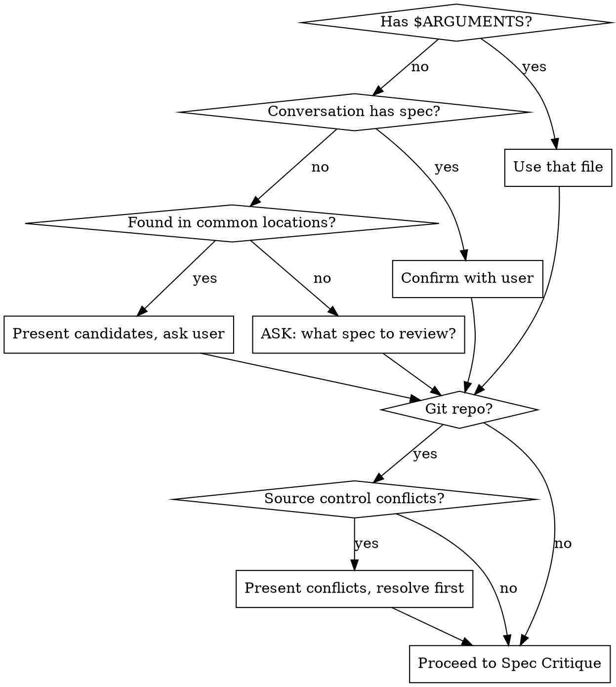

# Spec Pushback

Critically reviews a spec, PRD, requirements document, or design plan before work begins. Checks source control for conflicts with reality, then walks through issues one at a time in severity order so you can fix what matters most.

**This skill does NOT recommend a fresh session.** The conversation history may be the spec.



## Input Resolution

Resolve the spec to review in this order:

1. **`$ARGUMENTS` contains a file path** → use that file
2. **Conversation history contains a spec/plan/design** (from brainstorming, plan writing, or the user describing what they want) → confirm with user: "I see the design we just discussed — should I review that?"
3. **Scan common locations** → look for recently modified files in `docs/plans/`, `docs/specs/`, and files named `requirements.md`, `PRD.md`, `spec.md`, or similar in the repo root. If one obvious candidate, confirm. If multiple, present the list and ask.
4. **Nothing found** → ask: "What spec should I review? Give me a file path, or describe what you want to build and I'll push back on that."

## Phase 1: Reality Check (Source Control)

**Skip this phase if the project is not a git repository.**

Before analyzing the spec itself, check whether recent codebase changes conflict with what the spec assumes:

1. Run `git log --oneline -50 --since="2 weeks ago"` (whichever limit is reached first)
2. Read commit messages and, for relevant-looking commits, check the actual diffs
3. Compare against the spec's assumptions — does the spec reference code, tables, APIs, infrastructure, or patterns that have recently been changed, removed, or replaced?
4. **If conflicts found:** present them upfront before any other analysis. For each conflict:
   - What the spec assumes
   - What actually changed (commit SHA, date, summary)
   - Why this matters
   - Ask: "How do you want to handle this?" with options
5. **If no conflicts found:** say "No conflicts with recent changes" and move on

This phase surfaces showstoppers early. A spec that assumes deleted infrastructure is wrong before the analysis even starts.

## Phase 1.5: Scope Shape

Before digging into individual requirements, check whether the spec has structural problems that should be addressed first.

### Check 1: Feature Cohesion

Do the features in this spec serve different user goals or business objectives? If the spec bundles unrelated features — things that would naturally be separate PRs — flag it.

For each group of unrelated features:
- Identify the groups and what makes them unrelated (different user goals, different business objectives, different system concerns)
- Recommend splitting into separate specs
- Ask: "Do you want to split these out before I continue, or review as-is?"

If the user splits, continue reviewing the remaining spec. If they choose to review as-is, proceed — but note it as a scope concern.

### Check 2: Spec Size

Use heuristic signals to assess whether the spec is too large to implement safely:
- Many distinct features or requirements (roughly 8+)
- Multiple unrelated system areas affected
- Very long document
- Estimated implementation would touch many modules across the codebase

**If large AND a meaningful split exists** where each piece delivers independent value: suggest the split with a brief explanation of what each piece delivers on its own.

**If large BUT the features are tightly interdependent:** flag the size and explain why splitting isn't practical — describe the interdependencies that make the features inseparable. The author knows it's big but also knows the bigness is inherent, not accidental.

**If not large:** say nothing and move on to Phase 2.

### Ordering

Run cohesion before size. If unrelated features are found and the user agrees to split, the size problem may resolve itself.

## Phase 2: Spec Critique

Analyze the spec against these categories:

| Category | What to look for |
|----------|-----------------|
| **Contradictions** | Requirements that conflict with each other, or with the current codebase state |
| **Feasibility** | Requirements that are technically difficult or impossible given the codebase as it exists today — missing infrastructure, incompatible architecture, dependencies that don't support the requirement |
| **Scope imbalance** | Requirements wildly disproportionate in effort relative to the rest — one bullet point that's a 2-week project next to others that are 2-hour tasks |
| **Omissions** | Missing requirements that are implied or necessary given context — error handling, edge cases, migration paths, rollback plans, monitoring, permissions |
| **Ambiguity** | Requirements that could be interpreted multiple ways — vague success criteria, undefined terms, unclear scope boundaries |
| **Security concerns** | Requirements that introduce or ignore security risks — auth gaps, data exposure, injection surfaces, missing rate limits, privilege escalation |

### Presentation order

1. Rank all findings by severity (most impactful first)
2. Present **one issue at a time**
3. For each issue:
   - State the problem clearly
   - Present specific options from best to worst, with your recommendation and a short explanation for each
   - Wait for the user's response before presenting the next issue
4. The user can say "good enough" or "stop" at any point to end the review

### Analysis guidance

- **Read the codebase.** Don't just review the spec in isolation — check whether what it describes is feasible given actual code, actual schemas, actual infrastructure.
- **Be concrete.** "This is ambiguous" is unhelpful. "This says 'fast response times' — do you mean <200ms p99? <1s? This determines whether you need caching." is useful.
- **Don't nitpick wording.** Focus on issues that would cause real problems during implementation or after launch.
- **Respect scope.** The spec author chose what to include and exclude. Flag genuine omissions, not "nice to haves." If something is intentionally out of scope, don't push back on it unless it creates a real gap.
- **Consider the audience.** A rough spec from a brainstorming session deserves different treatment than a formal PRD about to be handed to a team.

## Phase 3: Resolution

After all issues are addressed (or user says "good enough" / "stop"):

Ask: **"Would you like me to update the spec directly, or write a separate pushback report?"**

### If updating the spec

- Apply agreed-upon changes to the original file
- Add/modify requirements based on the user's responses
- Don't touch requirements that weren't discussed
- If the spec came from conversation history and hasn't been saved to a file, ask: "The spec isn't saved to a file yet. Where should I write it?" — suggest a reasonable path

### If writing a report

Write to `paad/pushback-reviews/<YYYY-MM-DD>-<spec-name>-pushback.md`.

Create the `paad/pushback-reviews/` directory if it doesn't exist.

**Report template:**

```markdown
# Pushback Review: <spec name or filename>

**Date:** YYYY-MM-DD
**Spec:** <file path or "conversation history">
**Commit:** <current HEAD sha, or "N/A">

## Source Control Conflicts

<conflicts found, or "None — no conflicts with recent changes.">

## Issues Reviewed

### [1] <title>
- **Category:** <contradictions / feasibility / scope imbalance / omissions / ambiguity / security>
- **Severity:** <critical / serious / moderate / minor>
- **Issue:** <what's wrong>
- **Resolution:** <what the user decided>

(Repeat for each issue discussed.)

## Unresolved Issues

Issues not yet discussed (user stopped early). Listed for future reference.

### [N] <title>
- **Category:** ...
- **Severity:** ...
- **Issue:** ...
- **Suggested options:** ...

(Omit section if all issues were addressed.)

## Summary

- **Issues found:** N
- **Issues resolved:** M
- **Unresolved:** N - M
- **Spec status:** <ready for implementation / needs further work>
```

### If the spec came from conversation history

Ask: "The spec isn't saved to a file yet. Want me to write it to a file first?" Suggest a reasonable path based on the project structure (e.g., `docs/plans/`, `docs/specs/`). Then proceed with the chosen output option (update or report).
